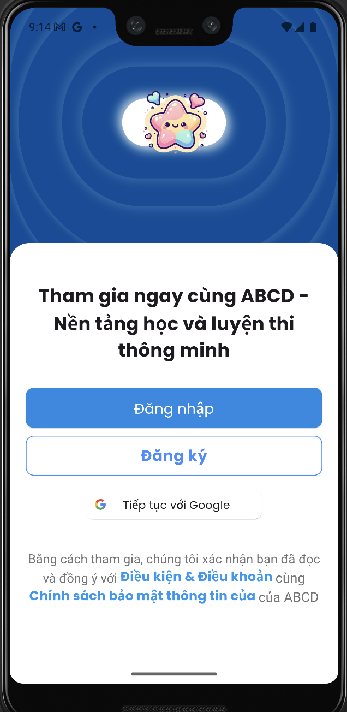
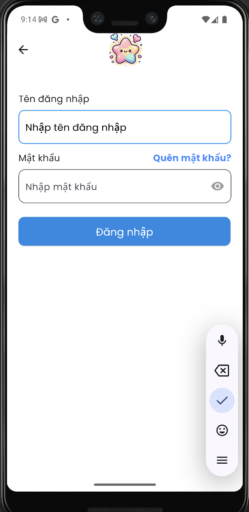
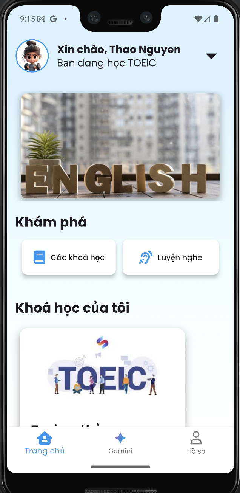
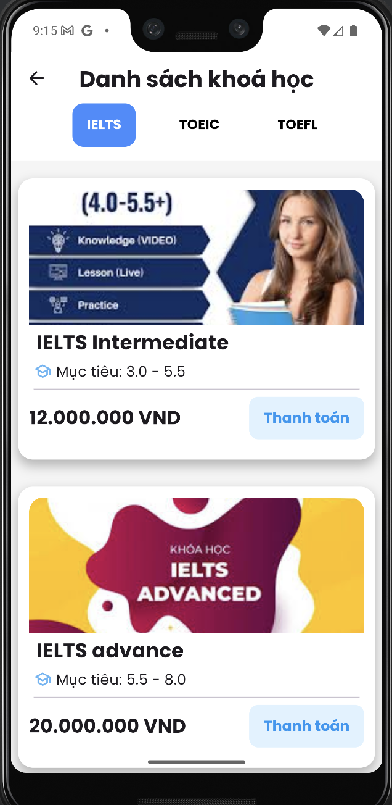

📚 English Learning App
A full-stack English learning platform built with Flutter and Django, designed to help users study English effectively through video lessons, AI support, and interactive learning features.

# Feature
✅ User registration with Google OAuth2

🔐 Password reset via Firebase Dynamic Links

💳 Stripe integration for paid course access

🎬 Video lesson playback with teacher upload support

🤖 AI Assistant (Gemini API) for English Q&A

🔊 Text-to-Speech for audio learning

☁️ Media storage: AWS S3 (videos) & Cloudinary (images)

🐳 Dockerized backend, deployed to VPS

# Tech Stack
Layer	Technology
Frontend	Flutter
Backend	Django, Django REST framework
Database	MySQL
Auth	Google OAuth2, Firebase
AI APIs	Gemini (Chat), Text-to-Speech
Payments	Stripe
Storage	AWS S3, Cloudinary
Queue Tasks	Celery, Redis
Tools	Docker, Postman, Ngrok
Deployment	Gunicorn on VPS

# How to Run (Local Setup)
Backend (Django)
# Clone the repo
git clone https://github.com/yourusername/education_app.git

# Run with Docker
docker-compose up --build

🔗 Default Admin:
http://localhost:8000/admin/

Frontend (Flutter)
# Run Flutter app
flutter pub get
flutter run

# Screenshots

<table>
  <tr>
    <td><strong>📘 Welcome Screen</strong></td>
    <td><strong>📘 Login Screen</strong></td>
  </tr>
  <tr>
    <td></td>
    <td></td>
  </tr>
  <tr>
    <td><strong>📘 Home Screen</strong></td>
    <td><strong>📘 Courses Screen</strong></td>
  </tr>
  <tr>
    <td></td>
    <td></td>
  </tr>
</table>

